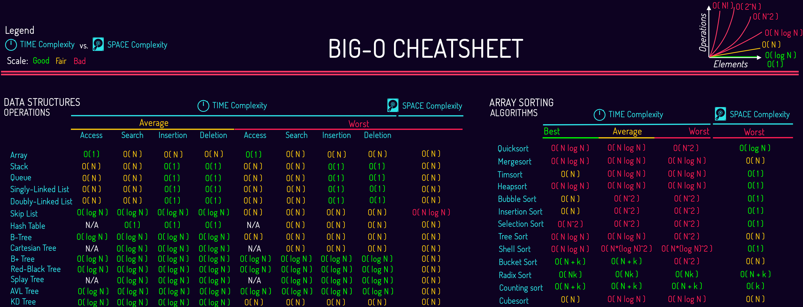

# Javascript notes

## Table

- [Js Primitive Types](#js-primitive-types)
- [Boolean](#boolean)
- [Null](#null)
- [Undefined](#undefined)
- [Numbers](#numbers)
- [String](#string)
- [Symbol](#symbol)
- [Operators](#operators)
- [Regular Expression](#regular-expression)
- [Array](#array)
- [Set](#set)
- [Map](#map)
- [Object](#object)
- [Generator and iterator](#generator-and-iterator)
- [Function](#function)
- [Hoist](#hoist)
- [Asynchronous Javascript](#asynchronous-javascript)
- [Promise](#promise)
- [Async Await](#async-await)
- [Renderer Process](#renderer-process)
- [Task queue vs Microtask queue](#task-queue-vs-microtask-queue)
- [Event Loop](#event-loop)
- [DOM Traversal](#dom-traversal)
- [Web APIs](#web-apis)
- [Interesting concepts](#interesting-concepts)

---

### JS Primitive Types

- Number, String, Boolean, null, undefined, BigInt, Symbol (#js primitive)

- `var.valueOf()`: return the primitive value
- `typeof var`: return the variable type in `string` format

Primitives are immutable, can be **replaced** but **not directly altered**, e.g.,:

    var str = "cool";
    str[2] = "l"; /*This doesn't work*/

- Another data type is **composite** (reference) type: constructed using primitive data types
  and other composite types.

##### **[Back to table](#table)**

---

### Boolean

`true` or `false`, no quotes, any value in JS can be used for boolean

|                     Falsy                     |                     Truthy                     |
| :-------------------------------------------: | :--------------------------------------------: |
| 0, -0, null, NaN, undefined, ""(empty string) | anything else (like empty object, empty array) |

<br>

- Operators that return Boolean results:

  - **Equality**, **Inequality** & **Strict equality**, **strict inequality**:
    - `==` `!=` & `===` `!==`
  - **Greater**, **greater or equal than** & **less**, **less or equal than**:
    - `>` `>=` & `<` `<=`
  - **in** operator: `prop in object`

    - check if `object` (or its prototype chain) contains the property with specified name `prop`.

<br>

##### **[Back to table](#table)**

---

### Null

Intentional absence of any value, **must be assigned**

<br>

##### **[Back to table](#table)**

---

### Undefined

Variables that do not have an assigned value, from values that **hasn't been defined** or **doesn't exist**

<br>

##### **[Back to table](#table)**

---

### Numbers

- No positive|negative|integers|decimal classes, uses **double-precision 64-bit binary format IEEE 754**
  - Binary 64 has (from left to right):
    - Sign bit: 1 bit (63)
    - Exponent: 11 bits (62 to 52)
    - Significand precision: 53 bits (**1 implicit starting bit** + 51 to 0)
  - precision range: 53-bit significand precision gives **15** to **17** significant decimal digits: (below start and final numbers and the same)
    - a digits decimal with **at most 15 significant digits** converted to double-precision format and then converted back to decimal
    - a double-precision format number converted to a decimal with **at least 17 significant digits**, and then converted back to double-precision format
- `NaN` is in also `number` type;
- Two zeros: `0` & `-0`
- Two infinities: `Infinity` & `-Infinity`

#### Math Object (commomly used)

#### Properties:

- `Math.PI` : PI
- `Math.E` : Euler's number (e)
  <br>

#### Static Methods

- `Math.floor(3.65) // 3` : nearest smaller integer
- `Math.ceil(-3.65) // -3 ` : neareast larger integer;
- `Math.round(3.65) // 4` : nearest integer (eg., +/-0.5 => 1/0);
- `Math.trunc(3.65) // 3` : integer part of given number;
- `Math.exp(2)` : e^2^
- `Math.log(2)` : ln2
- `Math.log10(2)` : log~10~2
- `Math.log2(3)` : log~2~3
- `Math.pow(3,7)` : 3^7^
- `(Math.ln(y)/Math.ln(x))` : log~x~y
- `Math.abs(-3) // 3` : |-3|
- `Math.sqrt(x)` : $\sqrt{x}$ (x>=0)
- `Math.sin/cos/tan/asin/acos/atan(x)`: trigonometric (x in radius)
- `Math.random()` : random number bewteen [0,1),
  - random number among [ 1, N ]: `Math.floor(Math.random()*N+1)`
- `Math.max/min(1,2,3) // 3, 1` : max/min value of inputs
  <br>

#### Number methods (commomly used)

#### Static Methods

- **Number()**: `Number(value) // converts value to number type`
  <br>
- **Number.isInteger()**: test if value is integer
  1. if not `number` type, return `false`
  2. if `number` type => test for `integer`
     <br>
- **Number.isFinite() / Number.isNaN() vs isFinite() / isNaN()**:

  - `Number.isFinite() / Number.isNaN()`:

    1. if not `number` type, return `false`
    2. if `number` type => test for `finite`/`NaN`

    - `Number.isNaN('3') // false`
    - `Number.isNaN('a') // false`

  - `isFinite() / isNaN()` : coerced to `number` type, then test for `finite`/`NaN`

    - `isNaN()` will only give `false` when the input is `number` or number in string type.
    - `isNaN('3') // false`
    - `isNAN('a') // true`;
      <br>

- **Number.parseInt() / parseInt()**: From left to right, **one digit** at a time, parse and convert to number: `parseInt(string, radix?)`
  - `radix`: _optional_, an integer between 2 and 36 that represents the radix. Default `10`.
  - if any digit in string cannot be parsed by the radix, it will stop at that digit
    - `parseInt('123', 3)` will return `12`, because first two digits can be parsed at radix of 3, which has `0`, `1` and `2`, three avaiable number outputs, but the third digit `3` is out of the range of 0 to 2, so for this digit it will return `NaN`. The final result is `12`
  - `Number.parseInt() === parseInt() // true`
  - `parseInt('123a456.7') // 123`
    <br>
- **Number.parseFloat() / parseFloat()**: From left to right, return starting float part

  - `Number.parseFloat() === parseFloat() // true`
  - `parseFloat('1.23a45') // 1.23`
    <br>

#### Instance Methods

- `.toExponential()`: `123.456.toExponential() = '1.23456e+2' `: return a <span>string</span> representing the scientific notation formatted number
  <br>
- `.toFixed()`: `123.456.toFixed(x) = '123.4' // x = 1 `: return a <span>string</span> representing the fixed-point notation number, [x] = 0
  <br>
- `.toPrecision()`: `123.456.toPrecision(x) = '1.2e+2' // x = 2 | '123.5' // x = 4` : return a <span>string</span> representing fixed-point or exponential notation rounded to precision significant digits
  <br>
- `.toString()`: `123.456.toString(b) = '443.212' // b = 5` : return a <span>string</span> representing the object in the specified radix (base), default [b] = 10
  - for integers, use double period: `123..toString(2) // '1111011'`
    <br>

##### **[Back to table](#table)**

---

### String

- quoted, single or double, consistent
- concatenate: `"hello" + ", " + "world!"` = `"hello, world!"`
- indexed: `var str = "hello";` `str[0]` is `"h"`, `str[1]` is `"e"`
- has **built-in iterator** which can be used to iterate over the string
- unchangeable (immutable), but reassignable;
- quotes in strings: `'He said "Hello!"'` or `"She says 'Goodbye'"`
- String template literals: <code> \`${expression}\` </code>
- Backslash (`\`) turns special characters (such as quote `'` or double quote `"`) into string characters. Use `\` to escape `'`, `"` and `\` in string (the escape backslash will only exist in the string value, it is not a string character and it can not be printed out by console.log):

  | Code | Result | Description  |
  | :--: | :----: | :----------: |
  | `\\` |  `\`   |  Backslash   |
  | `\'` |  `'`   | Single quote |
  | `\"` |  `"`   | Double quote |
  | `\t` |        |     Tab      |
  | `\n` |        |   Newline    |
  | ...  |        |   and more   |

  - `'\'` can not be printed out, because it escapes the closing single quote (`'`), which turns into a string character not a funcitonal character

  <br>

#### Static methods

- **String.fromCharCode(num1, [num2, ..., numN])**: returns a string created from the specified sequence of UTF-16 code units.
  - `num1, ..., numN`: A sequence of numbers that are UTF-16 code units. The range is between 0 and 65535
    <br>

#### Instance methods

- length: `str.length`

  - **return** the length of string

  <br><br>

- characterAt: `'hello'.charAt(1) = "e";` :

  <br>

- characterCodeAt: **return** UTF-16 code of the first letter `'hello'.charCodeAt(1) = "101";`

  <br>

- concat: `"Hello".concat(", ", "World!")`

  - **return**: a modified <span>copy</span> of `str` with concatenated `chars`/`substring`(`"Hello, World!`)

  <br>

- endsWith: `str.endsWith(searchstring, length?)`

  - **return**: `true` or `false`
  - `length`: _optional_ default `str.length`
  - `"markdown file".endsWith('down', 8) // true`
    <br>

- startsWith: `str.startsWith(searchstring, position?)`

  - **return**: `true` or `false`
  - `position`: _optional_ starting position (included), default`0`

  <br>

- includes: `str.includes(searchstring, position?)`

  - **return**: `true` or `false`
  - `position`: _optional_ starting position (included), default`0`
  - `"This is a markdown file".includes('This', 1) // false`

    <br>

- indexOf: `str.indexOf(searchstring, position?)`

  - **return**: first index of the first occurrence or -1 (not found)
  - `position`: _optional_ starting position (included), default`0`

  <br>

- lastIndexOf: `str.lastIndexOf(searchstring, position?)`

  - **return**: first index of the last occurrence or -1 (not found)
  - `position`: _optional_ ending position (included), default`0`

  <br>

- padStart: `str.padStart(targetlength, padstring?)`
- padEnd: `str.padEnd(targetlength, padstring?)`

  - **return**: a modified <span>copy</span> of `str` with `targetlength` and `padstring`
  - `targetlength`: length of the return `str`
  - `padstring`: _optional_ default <code>"&UnderBracket;"</code>(space)
  - return same copy if `targetLength` < `str.length`
    - `"hello".padStart(3) // "hello"` : `targetlength` < `str.length`
    - `"hello".padEnd(3) // "hello"` : `targetlength` < `str.length`
  - <code>"hello".padStart/End(10) // "&UnderBracket;&UnderBracket;&UnderBracket;&UnderBracket;&UnderBracket;hello"/"hello&UnderBracket;&UnderBracket;&UnderBracket;&UnderBracket;&UnderBracket;" </code>
  - `"hello".padStart/padEnd(10, '123') // "12312hello"/"hello12312"` : `padstring.length` < `targetlength` - `str.length`
  - `"hello".padStart/padEnd(10, '12345678') // "12345hello"/"hello12345"` : `padstring.length` > `targetlength` - `str.length`

  <br><br>

- trim: `str.trim()`
  - **return**: a modified <span>copy</span> of `str` with whitespaces at beginning and end are removed
    <br>
- trimStart: `str.trimStart()`
  - **return**: a modified <span>copy</span> of `str` with whitespaces from beginning are removed
    <br>
- trimEnd:`str.trimEnd()`

  - **return**: a modified <span>copy</span> of `str` with whitespaces from end are removed

  <br><br>

- repeat: `"Aaa".repeat(3)`

  - **return**: a modified <span>copy</span> of `str` with repeating (`"AaaAaaAaa"`)

  <br><br>

- replace: `"Aaa".replace('a', '-') // "A-a"`

  - **return**: a modified <span>copy</span> of `str` with <span>first</span> occurance replaced

- replaceAll: `"Aaa".replaceAll('a', '-') // "A--"`

  - **return**: a modified <span>copy</span> of `str` with <span>all</span> occurance replaced

  <br><br>

- search: `"hello".search('e') // 1`

  - **return**: index of first occurence or -1 (not found)
  - vs `.indexOf()`:
    - `.search()` can take Regex while `.indexOf` cannot
    - `.search()` cannot take second argument as start position

  <br><br>

- slice: `str.slice(start, end?)`

  - **return**: a modified <span>copy</span> of `str[start]` (included) to `str[end]` (excluded)
  - `start`: starting index (included)
  - `end`: _optional_ ending index (excluded), default `str.length`
  - `start` and `[end]` could be negative integer
  - `"hello".slice(1) // "ello", remove first char`
  - `"hello".slice(-1,1) // ""` : `start` > `end`
    <br>

- substring: `str.substring(start, end?)`

  - **return**: a <span>copy</span> from `str[start]` (included) to `str[end]` (excluded)
  - vs `str.slice()`:

    - Negative and larger than `str.length` indexes are treated as 0 and `str.length` in `.substring`, repectively:

      ```
      "hello".substring(-1,6) // same as "hello".substring(0,5), 'hello'
      ```

    - <span>Swap</span> `start` and `end` when `start` > `end` for `.substring()`:
      ```
      "hello".substring(4,1) // same as "hello".substring(1,4), "ell"
      ```

    <br><br>

- split: `str.split(seperator?,limit?)`

  - **return**: an `array` whose elements are substrings of `str` seperated by `seperator`, and `array.length` <= `limit`
  - `seperator`: _optional_ if leave blank, will put entire string as only element in an array, `'abc'.split(); // ['abc']`
  - `limit`: _optional_ Maximum number of elements in the returned subarray. If `limit` is `0`, `[]` is returned
  - `"a b c d e f".split(' ',4) // ['a','b','c','d']` : 4 elements
  - `"a b c d e f".split(',') // ['a b c d e f']` : 1 element cause `['a b c d e f']` has no `','`
    <br>

- toLowerCase: `"Hello".toLowerCase() // "hello"`
- toUpperCase: `"Hello".toUpperCase() // "HELLO"`

  <br>

- toString: `str.toString() // works on String Object, same as str.valueOf()`
  <br>

- match: `str.match(regex)` retrieves the result of matching a string against a regular expression.
  - **return**: An Array whose contents depend on the presence or absence of the global (`g`) flag, or `null` if no matches are found.
    - with `g` : all matches
    - without `g`: the first match

<br>

##### **[Back to table](#table)**

---

### Symbol

- can only be created with `Symbol(lable?)` without `new`
  - `label`: _optional_ a note for this symbol
- each symbol is unique
- a symbol value is only used as an identifier for object propeties
- when add a symbol as a property, there are two ways
  ```
  const propSym = Symbol('prop')
  obj[propSym] = propValue
  ```
  or
  ```
  const propSym = Symbol('prop')
  obj = {
    [propSym] : propValue
  }
  ```
- Symbols are not enumerable, so it will not show up in `for...in` loop or `Object.getOwnPropertyNames()`
- Symbols can be accessed by `Object.getOwnPropertySymbols()`

<br>

##### **[Back to table](#table)**

---

## Operators

- `&&` Logical AND:

  - `expr1 && expr2 && expr3 && ....`
  - from left to right, return immediately with the value of the first falsy operand (`false`, `null`, `NaN`, `0`, emtpy string, `undefined`)
  - if all values are truthy, the value of the last operand is returned.
    <br>

- `||` Logical OR

  - `expr1 || expr2 || expr3 || ....`
  - from left to right, return immediately with the value of the first truthy operand (anything that is not falsy)
  - if all values are falsy, the value of the last operand is returned.
    <br>

- `??` Nullish coalescing operator

  - `leftExpr ?? rightExpr`
  - from left to right, return immediately with the value of the first operand that is **not** `null` or `undefined`
  - if all values are `null/undefined`, the value of the last operand is returned.
  - cannot directly be used with `&&` or `||`, must use parenthesis to explicityly indicate precedence.
    <br>

- `&&=` Logical AND assignment

  - `expr1 &&= expr2`
  - equivalent to `expr1 && (expr1 = expr2)`, meaning if `expr1` is truthy, assign the evaluated value of `expr2` to `expr1`;
    <br>

- `||=` Logical OR assignment

  - `expr1 ||= expr2`
  - equivalent to `expr1 || (expr1 = expr2)`, meaning if `expr1` is falsy, assign the evaluated value of `expr2` to `expr1`;
    <br>

- `??=` Nullish coalescing assignment

  - `expr1 ??= expr2`
  - equivalent to `expr1 ?? (expr1 = expr2)`, meaning if `expr1` is `null/undefined`, assign the evaluated value of `expr2` to `expr1`;

- Bitwise operators:
  - `&` (AND): `0011 & 0101 -> 0001`
    - Set each bit to 1 if both bits are 1
  - `|` (OR): `0001 | 0101 -> 0111`
    - Set each bit to 1 if one of two bits is 1
  - `^` (XOR): `0011 ^ 0101 -> 0110`
    - Sets each bit to 1 if <span>only</span> one of two bits is 1
  - `~` (NOT): Inverts all the bits
    - for integers, add a negative sign and then minus 1:` ~5 -> -6`
  - `<<` (Zero fill left shift):
    - Shifts left by pushing zeros in from the right and let the leftmost bits fall off
  - `>>` (Signed right shift):
    - Shifts right by pushing copies of the leftmost bit in from the left, and let the rightmost bits fall off
  - `<<<` (Zero fill right shift):
    - Shifts right by pushing zeros in from the left, and let the rightmost bits fall off

<br>

##### **[Back to table](#table)**

---

## Regular expression

- RegEx is used to <span>match character</span> combinations in strings
  <br>
- A RegEx is an <span>object</span>
  <br>
- RegExs are used with the RegExp methods
  <br>

- RegEx is <span>case sensitive</span>, and by default it only return the <span>FIRST</span> match
  <br>

- Two ways to create a `RegEx` object: a literal notation and a constructor:
  - **literal notation** : a pattern between **two forward slashes** (`/.../`), followed by **optional flags**
    - `let re = /ab+c/i`
  - **constructor function**: two parameters(a string or a RegExp object as its first parameter, and a string of optional flags as its second parameter) - `let re = new RegExp('ab+c', 'i')`
    <br>

#### RegEx syntax within `/.../`:

- Character Classes .

  - `[]`:
    - `[abc]`: match **ONE single character** from **a set of characters**. // `a` or `b` or `c`;
    - `[2-8]`: any single digit number from 2 to 8.// `2` or `3` or `4` or .... or `8`
    - `[c-h]`: any single digit letter from c to h.// `c` or `d` or `e` or .... or `h`
    - `[c-hD-Z]`: any single digit letter from c to h or from D to Z.
      <br>
  - `.` (wildcard character): matches <span>any single character</span> except for line terminators (\n, \r, \u2028, \u2029)
    <br>
  - `[^...]`(Negate symbol): `[^abc]` matches any single character that is **NOT** from these characters.
    <br>
  - `|` (or): `abc|xyz` matches "abc" or "xyz"
    - `(p|b)ear`: matches "pear" or "bear", use `()` to represent an entity.

  <br>

- Quantifiers:

  - `x+`: matches the preceding item "x" <span>1 or more</span> times (unlimited).
  - `x*`: matches the preceding item "x" <span>0 or more</span> times (unlimited).
  - `x{n}`: matches <span>EXACTLY</span> "n" (a positive integer) occurrences of the preceding item "x".
    - `x{n,}`: matches <span>AT LEAST</span> "n" (a positive integer) occurrences of the preceding item "x".
    - `x{n,m}`: matches <span>at least</span> "n", <span>at most</span> "m" (n < m) occurrences of the preceding item "x".
      <br>
  - `x?`: matches the preceding item "x" 0 or 1 times.

- Metacharacters: (metacharacters can also be used in "[]": `[abc\d]` same as `[abc0-9]`)

  - `\`: escape character, any character behind it will be literal except for other metacharacters
  - `\d`: same as `[0-9]`, match any digit number character
  - `\w`: same as `[a-zA-Z0-9_]`, match any <span>letter</span> (case insensitive), <span>number</span> and <span>underscores</span>
    - `\W`: same as `[^a-zA-Z0-9_]`, match any characters but letter (case insensitive), number and underscores
  - `\s`: match whitespace characters (spaces, tabs etc)
    - `\S`: match any characters but whitespace characters (spaces, tabs etc)
  - `\t`: match tab character only
    <br>

- Assertions (boundaries)
  - `^...`: matches the <span>beginning</span> of input. (notice the difference with `[^]`)
  - `...$`: matches the <span>end</span> of input.
    - `^x{n}$`: <span>EXACTLY</span> n (positive integer) characters

#### Optional Flags at the end:

Settings added at the **end of RegEx** that can be applied to **modify its behavior**

- `g` : find all that matches, don't return after match
- `i`: case insensitive for all letter characters
  - `/[a-zA-Z]/` is the same as `/[a-z]/i`

<br>

#### RegExp methods

`const reg = /[abc]/i`

- `reg.test(str)`: test to see if matches: `reg.test('A') // true`

<br>

##### **[Back to table](#table)**

---

## Array

- resizable
- integers as indexes
- has **built-in iterator** which can be used to iterate over the array
- pass as reference
  <br>

#### Array static methods

- array-like objects:

  - objects with a length property and indexed elements
  - iterable objects (like `Map` and `Set`)
    <br>

- Array: `Array(/*...*/)`

  - **return**: a new `Array` instance
  - can work as a constructor or a function

    1. constructor: work with `new` operator
    2. function: creates and initialises a new `Array` object, same as `new Array()`

    ```
    // From elements
    new Array(element0, element1, ... , elementN)
    Array(element0, element1, ... , elementN)

    // From array length (interger argument), empty array with a length
    new Array(arrayLength)
    Array(arrayLength)
    ```

    <br>

- Array.of: `Array.of(element0, element1?, /* … ,*/?, elementN?)` creates a new Array instance from a variable number of arguments, regardless of number or type of the arguments.

  - **return**: a new `Array` instance.
  - `elementN`: Elements used to create the array.
  - `Array.of()` vs `Array()`
    ```
    Array.of(3) // [3]
    Array(3) // [empty * 3] An array of 7 empty slots
    ```
    <br>

- Array.from: `Array.from(arrayLike, callbackFn?(element, index?){/*...*/}], thisArg?)`

  - **return**: a new `Array` instance
  - `callbackFn`: _optional_ A function to call on every element of the array
    - `element`: the current element being processed in the array.
    - `index`: _optional_ the index of the current element being processed in the array.
  - `thisArg`: _optional_ Value to use as `this` when executing `callbackFn`.
  - for array-like object specifically.

    - object with a `length` property
    - indexed elements

    ```
    Array.from({length: 3}) // [undefined, undefined, undefined]
    Array.from({length: 3}, (v,i) => i) // [0, 1, 2]

    Array.from('hello') // ['h', 'e', 'l', 'l', 'o']
    ```

- Array.isArray: `Array.isArray(value)` determine whether the passed `value` is an `Array`

  - **return**: true if the `value` is an Array; otherwise, `false`.
    <br>

#### Array instance methods

`const arr = [1, 2, 3, 'a', 'b', 'c']`
<br>

- at: `arr.at(-1) // 'c'`

  - **return**: item at the index
  - negative number count back from last item.
    <br>

- with: `arr.with(index, newValue)`

  - **return**: a <span>copy</span> with a `newValue` at the `index`
  - negative index count back from last item.
  - If `index` > `array.length` or `index` < `-array.length`, throww `RangeError`
    <br>

- indexOf: `arr.indexOf(searchElement, start?)`

  - **return**: the <span>index</span> of the first element in the array or -1 (not found)
  - `start`: _optional_ starting index (included)

- lastIndexOf: `arr.lastIndexOf(searchElement, start?)`

  - **return**: the <span>index</span> of the last element in the array or -1 (not found)
  - `start`: _optional_ starting index (included)
    <br>

- includes: `arr.includes(searchElement, start?)`(case-sensitive)

  - **return**: `true` or `false`
  - `start`: _optional_ starting index (included), default `0`
  - `arr.includes('a', 4) // false`

  <br>

- join: `arr.join(seperator?)`

  - **return**: a <span>string</span> with all array elements joined.
  - `seperator`: _optional_ default `","`

- toString: `arr.toString()`

  - **return**: a <span>string</span> representing the elements of the array.
  - is the same as `arr.join()`
    <br>

- concat: `arr.concat(arr, value1?, /*...*/?, valueN?])`

  - **return**: a modified <span>copy</span> of `arr` with concatenated elements
  - `valueN`: _optional_ Arrays and/or values to concatenate into a new array
  - `arr.concat([4,5,6],'d','e','f') // [1,2,3,'a','b','c',4,5,6,'d','e','f']`
    <br>

- slice: `arr.slice(start?, end?)`

  - **return**: a modified <span>copy</span> of `arr` with array elements from `arr[start]` (included) to `arr[end]` (excluded)
  - `start`: _optional_ default `0`, could be negative integer
  - `end`: _optional_ default `arr.length`, could be negative integer
    <br>

- flat: `arr.flat(depth?)`

  - **return**: a modified <span>copy</span> of `arr` with sub-array elements concatenated into it
  - `depth`: _optional_ default `1` (from outside to inside)
  - `[1,[2,[3,4]]].flat() // [1,2,[3,4]]`
    <br>

- copyWithin: `arr.copyWithin(targetIndex, start?, end?)`(<span>mutator method</span>)

  - **return**: the modified array whose elements are replaced starting from `targetIndex` with elements from `start`(included) to `end` (excluded), no change to `arr.length`
  - `start`: _optional_ starting index (included), default `0`
  - `end`: _optional_ ending index (excluded), default `arr.length`
  - `targetIndex`, `start`, `end` could be negative integer
  - no change when `start` >= `end`
  - no change when `targetIndex` > `arr.length`
  - `arr.copyWithin(1,3,5) // [1,'a','b','a','b','c']`: start from `arr[1]`,replace `arr[1]`, `arr[2]` with `arr[3]`, `arr[4]`, the rest remain the same
    <br>

- fill: `arr.fill(value, start?, end?)`(<span>mutator method</span>)

  - **return**: the modified array whose elements are replaced with `value` from `start`(included) to `end` (excluded), no change to `arr.length`
  - `start`: _optional_ starting index (included), default `0`
  - `end`: _optional_ ending index (excluded), default `arr.length`
    <br>

- reverse: `arr.reverse()` (<span>mutator method</span>)
  - **return**: the <span>modified</span> array whose elements order are reversed
- toReversed: `arr.toReversed()`

  - **return**: a modified <span>copy</span> array whose elements order are reversed
    <br>

- pop: `arr.pop()` (<span>mutator method</span>)

  - **return**: the removed element (last) from the array; undefined if the array is empty.

- push: `arr.push(element(s))` (<span>mutator method</span>)

  - **return**: the new `length` property

- shift: `arr.shift()` (<span>mutator method</span>)

  - **return**: the removed element (first) from the array; undefined if the array is empty.

- unshift: `arr.unshift(element(s))` (<span>mutator method</span>)

  - **return**: the new `length` property

  <br>

- splice: `arr.splice(start, deletecount?, additem(s)?)` (<span>mutator method</span>)

  - **return**: an array containing the deleted elements
  - `start`: starting index (included)
  - `deletcount`: _optional_ default `array.length - start` (number of elements in array), if omitted, will delete all elements in array and return them in an array.

- toSpliced: `arr.toSpliced(start, deletecount?, additem(s)?)`

  - **return**: a <span>copy</span> array with some elements removed and/or replaced at a given index.

  ```
  let arr = [1,2,3]
  let removed = arr.splice(0)
  // arr is []
  // removed is [1,2,3]
  ```

  <br>

#### Array callback methods

- Parameters: `array.prototype.xxx(callbackFn, thisArg?)`

  - `callbackFn`:
    - Arrow function: `(element, index?, array?) => {/*...*/}`
    - Callback function: `callbackFn`
    - Inline callback funciton: `function(element, index?, array?) {/*...*/}`
      <br>
  - `thisArg`: `this` when executing `callbackFn`)

    <br>

- **<span>Note</span>**: index manipulation during iteration doesn't affect next iteration, this is different from `for (let i = 0; i < array.length; i++)`iteration
  <br>

- .every(_f_): **return** `true` if `callbackFn` returns a truthy value for <span>every</span> `element`
  .some(_f_): **return** `true` if `callbackFn` returns a truthy value for <span>at least one</span> `element`
  <br>

- .forEach(_f_): **return** `undefined`, it executes `callbackFn` once for <span>each</span> `element`
- .map(_f_): **return** a new `array` with the results of `callbackFn` for <span>each</span> `element`
  <br>
- .reduce(_f_): **return** the **<span>accumulated</span>** value from running `callbackFn` over the entire array
- .reduceRight(_f_): same as `.reduce()`, but the order is right-to-left

  - `element` here are two arguments: `accumulator` & `currentElement`
  - `index` here is `currentElementIndex`
  - no `thisArg`, instead there is a `initialValue`, it could be any value
  - if `initialValue`:
    - `accumulator` = `initialValue`
    - `currentElement` = `array[0]`
    - start from first element `array[0]`
  - if no `initialValue`:
    - `accumulator` = `array[0]`
    - `currentElement` = `array[1]`
    - start from second element `array[1]`

  <br>

- .find(_f_): **return** the <span>first</span> `element` in array which makes `callbackFn` return `true`, or `undefined` if not found
- .findIndex(_f_): **return** <span>index</span> of the first `element` in the array which makes `callbackFn` return `true`, or `-1` if not found
- .filter(_f_): **return** a <span>new array</span> with all the `elements` which makes `callbackFn` return `true`, or `[]` if no `element` is found
  <br>
- .sort(_f_): **return** the sorted array (<span>mutator method</span>)

  - `arr.sort([compareFn(a,b)])` e.g., `arr.sort((a, b) => a - b)`
  - `compareFn` return
    - negative: a placed before b
    - positive: b placed before a
    - `0`: a, b order unchange
  - if omit `compareFn`, a & b are converted to strings, then sorted according to each `char` Unicode value

- .toSorted(_f_): **return** the sorted <span>copy</span> array, other than that same as `sort()`

<br>

##### **[Back to table](#table)**

---

## Set

The Set object lets you store <span>unique</span> values of any type, whether primitive values or object references.

- `Set`: set constructor, work with `new` to creates a new Set object.

  ```
  // Create a new empty Set
  const setObj = new Set()

  // Pass an iterable object to Set, duplicated will only add once
  const arr = ['a', 'a', 'b', 'c'];
  const setObj = new Set(arr); // Set(3) {'a', 'b', 'c'}
  ```

  <br>

- size: `setObj.size`

  - how many entries the Set object has
    <br>

- add: `setObj.add(value1)[.add(value2)]`

  - **return**: the Set object with added value
  - chainable, but can only add one element at a time
  - if pass multiple values, it will only try to add the first value
    <br>

- delete: `setObj.delete(value)`

  - **return**: `true` if value was found and removed in Set object; otherwise `false`
    <br>

- clear: `setObj.clear()`

  - **return**: `undefined`
    <br>

- has: `setObj.has(value)`

  - **return**: `true` if value exists in the Set object; otherwise `false`
    <br>

- values/keys:`setObj.valuse/keys()` both **return** an iterator that contains the values for each element in Set object
- entries: `setObj.entries()` **return** an iterator that contains an array of `[value, value]` for each element in Set Object, in **insertion** order.
  <br>

- forEach: `setObj.forEach(callbackFn, thisArg?)`: executes a provided function once for each value in the Set object, in **insertion** order.
  - **return** : `undefined`
  - `callbackFn`: takes in 3 arguments:`value?`, `key?`, `setObj?`
  - `thisArg`: _optional_ A value to use as `this` when executing `callbackFn`.

##### **[Back to table](#table)**

---

## Map

- The `Map` object holds key-value pairs and remembers the <span>original insertion order</span> of the keys.
- Any value (Primitive or Composites) may be used as either a **key** or a **value**.
  <br>
- Objects vs Maps
  ✔ <span>Accidental Keys</span>: An object usually has `prototype`, which contains default keys and may collide with user assigned keys; Map does not contain any key by default, and keys must be **explicitly** put into it
  ✔ <span>Security</span>: As shown above, objects have `prototype` which may lead to **object injection attacks**, while maps is safe to use user-provided keys and values
  ✔ <span>Key Types</span>: Maps can have **any** value for key, even functions
  ✔ <span>Key Order</span>: Map object iterates entries, keys, and values in the **order of entry insertion**
  ✔ <span>Size</span>: Map object has `size` property to easily access its number of items.
  ✔ <span>Iteration</span>: Map object is **iterable**, so it can use `for ... of` directly
  ✔ <span>Performance</span>: Map object perform better in frequent **additions** and **removals** of key-value pairs
  ❌ Serialization and Parsing: Map object **cannot** direcly be passed to `JSON.stringify()`/`JSON.parse()`, not without replacer argument and reviver argument. See [Stack Overflow question](https://stackoverflow.com/questions/29085197/how-do-you-json-stringify-an-es6-map)
  <br>

- Methods:

  - Constructor: must use with `new`

  ```
  // Create a new empty Map:
  const mapObj = new Map()

  // Pass an iterable object to Set, each element must be key-value pair, duplicated will only set to the last element
  const arr = [[1, 'a'], [2, 'a'], [1, 'b'], [2, 'c']];
  const mapObj = new Map(arr); // Map(2) {0: {1 => 'b'}, 1: {2 => 'c'}}
  ```

  - Size: `mapObj.size`: **return** the number of key/value pairs in the Map object.
    <br>
  - Set: `mapObj.set(key, value)`: <span>adds or updates</span> an entry in a Map object with a specified key and a value.
    - **return**: the Map object
      <br>
  - Get: `mapObj.get(key)`: get a specified element from a Map object.
    - **return**: the element associated with the specified key, or `undefined` if the key can't be found.
      <br>
  - Delete: `mapObj.delete(key)`: removes the specified element from a Map object by key.
    - **return**: `true` if an element in the Map object existed and has been removed, `false` if key did not existed.
      <br>
  - Has: `mapObj.has(key)`: whether an element with the specified key exists or not.
    - **return**: `true` if an element in the Map object existed, `false` if key did not existed.
      <br>
  - Clear: `mapObj.clear()`: removes all elements from a Map object.
    - **return**: `undefined`
      <br>
  - Keys/Values/Entries: `mapObj.keys/values/entries()`: returns a new map **iterator** object that contains the keys/values/`[key, value]` for each element in the Map object in <span>insertion order</span>.
    - **return**: A new iterable iterator object.
    - get the first set key:` mapObj.keys().next().value`;
    - get the first set value:` mapObj.values().next().value`;
    - get the first set pair array:` mapObj.entries().next().value`;
      <br>
  - ForEach: `mapObj.forEach(callbackFn, thisArg?)`: executes a provided function once per each key/value pair in the Map object, in <span>insertion order</span>.
    - **return**: undefined
    - `callbackFn`: takes in 3 arguments:`value?`, `key?`, `mapObj?`
    - `thisArg`: _optional_ A value to use as `this` when executing `callbackFn`.

### WeakMap

<br>

##### **[Back to table](#table)**

---

## Object

- <span>{ [key] : [value] }</span> pair
  - **key**: string (identifier), anything other than string will be forced to string type
    - name can be wrapped with brackets to get a computed value from an expression:

      ```
      const key = 'name';

      const obj = {
        [key]: 'xiao',
        [1 + 2]: 3,
      }
      // obj is { name: 'xiao', 3: 3}
      ```
  - **value**: anything (primitive data, array, function, other objects)
    <br>
- property accessors: dot(`.`) & bracket notation(`[]`)
  - `const obj = {'name' : 'Xiao', '2' : 2}`
  - `obj.name = 'Xiao'`
    - ~~`obj.2`~~
  - `obj['name'] = 'Xiao'`
  - `obj[2] = 2`
  - `obj['2'] = 2`
    - ~~`obj[name]`~~
  - when working with variables: `let key = 'name'`
    - `obj[key] = 'Xiao'`
    - ~~`obj.key`~~
      <br>
- Properties can be enumerated (for...in loop) if they are enumerable
  <br>
- Optional chaining (`?.`): If the object accessed or function called using this operator is `undefined` or `null`, the expression short circuits and evaluates to undefined instead of throwing an error.

  - `obj.val?.prop`:
  - `obj.val?.[expr]`:
  - `obj.func?.(args)`:

  <br>

- Object manipulation

  - add: `obj[newKey] = newValue`
  - update: `obj[key] = newValue`
  - delete: `delete obj[key]` or `delete obj.keyValue`

    <br>

- Getter: `get propertyName(){}` / `get [expression](){}`
  Retrieve the value of an object property, when access getter function name, return its return value.

  - `[expression]`: for a computed property name to bind to the given function
    <br>

  ```
  const person = {
    firstName: 'John',
    lastName: 'Doe',
    get fullName() {
      return `${this.firstName} ${this.lastName}`;
    }
  };

  console.log(person.fullName); // output: "John Doe"
  ```

  <br>

- Setter: `set propertyName(val){}` / `set [expression](val){}`
  Set the value of an object property, when assign new value, pass in the new value as the input and execute the setter function

  - `val`: the value attempted to be assigned to `propertyName`
  - `[expression]`: for a computed property name to bind to the given function
  - _Note_ : Setters are not meant to be accessed directly, any attempts to access it will result in `undefined`.
    <br>

  ```
  const person = {
    firstName: '',
    lastName: '',
    set fullName(name) {
      const parts = name.split(' ');
      this.firstName = parts[0];
      this.lastName = parts[1];
    }
  };

  person.fullName = 'John Doe';

  console.log(person.firstName); // output: "John"
  console.log(person.lastName); // output: "Doe"
  console.log(person.fullName); // output: undefined
  ```

  <br>

#### Methods:

- functions in objects
- `obj[methodName] = function () {/*...*/}`
- shorthand: `const obj = { methodName(){/*...*/} }`
- method invoke: `obj.methodName()`

  <br>

- Static methods:

  - `Object.is(value1, value2)`

    - **return**: A Boolean indicating whether or not the two arguments are the same value.
    - truthy: both `undefined`|`null`|`NaN`|`true`/`false`|same strings|same reference|same number|`+0`/`-0`
    - vs `==`: `Object.is()` does not coerce value types
    - vs `===`:
      - `-0 === 0` is true while `Object.is(-0, 0)` is false
      - `NaN === NaN` is false while `Object.is(NaN, NaN)` is true
        <br>

  - `Object.assign(target, ...sources)`

    - **return**: modified target object
    - Update target properties by properties in the sources if they have the same key
    - Define new properties to target if not exist

    ```
    const target = { a: 1, b: 2 };
    const source = { b: 4, c: 5 };
    const returntarget = Object.assign(target, source);

    console.log(target);   // expected output: Object { a: 1, b: 4, c: 5 }
    console.log(returntarget);   // expected output: Object { a: 1, b: 4, c: 5 }
    ```

      <br>

  - `Object.create(protoObj, propertiesObject?)`

    - **return**: always return an <span>empty object</span>, with the specified `__proto__` object and properties if `propertiesObject` is passed in
    - `propertiesObject`: _optional_ an object whose enumerable own properties specify property descriptors to be added to the newly-created object, with the corresponding property names.

      ```
      {
        propName:{
          /* Data descriptors or accessor descriptors */
        }
      }
      ```

    - create an object with no prototype (_it will loose all the Object methods_)
      ```
      const user = Object.create(null);
      // Add properties to the user object
      user.name = 'John';
      user.age = 30;
      ```
      <br>

  - `Object.defineProperty(obj, prop, descriptor)`

    - **return**: the object that was passed to the function
    - `prop`: the name or Symbol of the property to be defined or modified
    - `descriptor`: objects, could be _data descriptor_ or _accessor descriptor_

      ```
      // make a read-only object property
      const obj = {};
      Object.defineProperty(obj, 'a', {
        get: function() {
          return 123;
        },
        set: function(val) {
          throw new Error(`You are trying to re-assign property 'a' with value ${val}, however this property is read-only`)
        }
      });

      console.log(obj.a) // output: 123
      obj.a = 456 // output: Uncaught Error: This property cannot be reassigned
      ```

      - **data descritpor**: a property that has a value [default]
        - configurable [`false`]: `true` if this `prop` descriptor may be changed and this `prop` could be deleted from object
        - enumerable [`false`]: `true` if this `prop` shows up during enumeration (e.g., `for...in` loop, `console.log()` and `Object.keys()` returns enumerable properties only)
        - <span>value</span> [`undefined`]: property value
        - <span>writable</span> [`false`]: `true` if value can be changed with an assignment operator
        ```
        const object1 = {};
        Object.defineProperty(object1, 'property1', {
          value: 42,
          writable: false
        });
        ```
      - **accessor descriptor**: a property described by a getter-setter pair of functions

        - configurable [`false`]: same as in _data decsriptor_
        - enumerable [`false`]: same as in _data decsriptor_
        - <span>get</span> [`undefined`]: a function serves as a _getter_ for the property
        - <span>set</span> [`undefined`]: a function serves as a _setter_ for the property

       <br>

  - `Object.defineProperties(obj, props)`

    - _return_: the object that was passed to the function
    - props: `{prop1:{descriptors}, prop2:{descriptors}}`

      <br>

  - `Object.getOwnPropertyDescriptor(obj, prop)`

    - **return**: A property `descriptor` of the given property if it exists on the object, `undefined` otherwise.

  - `Object.getOwnPropertyDescriptors(obj)`

    - **return**: An object containing all own property descriptors of an object. Might be an empty object, if there are no properties.

    <br>

  - `Object.keys(obj)`

    - **return**: an array of strings representing all the <span>enumerable</span> properties
    - **non-negative integer** keys will be stored **_in front of_** `String` keys or float or negative number keys when using `Object.keys()`

  - `Object.values(obj)`

    - **return**: an array containing all the <span>enumerable</span> property values

      <br>

  - `Object.entries(obj)`

    - **return**: An array of the given object's own enumerable string-keyed property `[key, value]` pairs.

  - `Object.fromEntries(iterable)`

    - **return**: A new object whose properties are given by the entries of the iterable.

    - `Object.fromEntries()` performs the reverse of `Object.entries()`:

    ```
    const entries = [
      ['foo', 'bar'],
      ['baz', 42]
    ];

    const obj = {
      foo: 'bar',
      baz: 42
    };

    const entriesReturn = Object.entries(obj);
    // entriesReturn = [
    //   ['foo', 'bar'],
    //   ['baz', 42]
    // ];

    const fromEntriesReturn = Object.fromEntries(entries);
    // fromEntriesReturn = {
    //   foo: 'bar',
    //   baz: 42
    // };
    ```

    <br>

  - `Object.getPrototypeOf(obj)`
    - **return**: The `[[Prototype]]` of the given object, which may be `null`.

  <br>

  - `Object.hasOwn(instance, prop)`

    - **return**: `true` if the specified object has directly defined the specified property. Otherwise `false`
    - `Object.hasOwn()` is recommended over `Object.prototype.hasOwnProperty()` because it works for objects created using `Object.create(null)` and with objects that have overridden the inherited `hasOwnProperty()` method.

  <br>

  - `Object.preventExtensions(obj)` vs `Object.isExtensible(obj)`
    - **return**: same `obj` vs `true|false`
    - **Can not**:
      - add new properties
      - re-assign its prototype
    - **Still can**:
      - remove existing properties
      - change enumerability and configurability
      - change values of existing writable properties
      - add/remove new properties to its prototype
        <br>
  - `Object.seal(obj)` vs `Object.isSealed(obj)`

    - **return**: same `obj` vs `true|false`
    - Equals `Object.preventExtension(obj)` plus **Can not**:
      - remove existing properties
      - change enumerability and configurability
    - **Still can**:
      - change values of existing writable properties
      - add/remove new properties to its prototype
        <br>

  - `Object.freeze(obj)` vs `Object.isFrozen(obj)`
    - **return**: same `obj` vs `true|false`
    - Equals `Object.seal(obj)` plus **Can not**:
      - change values of existing writable properties
    - **Still can**:
      - add/remove new properties to its prototype
        - To freeze its prototype: `Object.freeze(obj.prototype)`
          <br>

#### Error Object:

`Error` objects are thrown when runtime errors occur. The `Error` object can also be used as a base object for user-defined exceptions.

- **Constructor**: `Error([message, options])`
  - `Error()` can be called with or without `new`. Both create a new `Error` instance.
    <br>
- **Instance properties**:
  - `err.message`: string, for user-created Error objects, this is the string provided as the constructor's first argument.
    ```
    const e = new Error("Could not parse input"); // e.message is 'Could not parse input'
    throw e; // get error: 'Uncaught Error: Could not parse input'
    ```
  - `err.name`: string, the initial value is `'Error'`, can be redefined
    ```
    const e = Error()
    console.log(e.name) // 'Error'
    e.name = 'ParseError';
    console.log(e.name) // 'ParseError'
    ```
  - `err.casue`: The value of cause can be of any type. The value that was passed to the `Error()` constructor in the `options.cause` argument. It may not be present. If presents, it indicates the specific original cause of the error.
    ```
    try {
      connectToDatabase();
    } catch (err) {
      throw new Error('Connecting to database failed.', { cause: err });
    }
    ```
- **Instance methods**:
  - `err.toString()`: return a string representing the specified `Error` object.
    ```
    const e = new Error("Could not parse input");
    e.name = 'ParseError';
    e.toString(); // 'ParseError: Could not parse input'
    ```
    <br>

##### **[Back to table](#table)**

---

## Generator and Iterator

**Generator function**:

- The `function*` declaration (`function` keyword followed by an asterisk `*`) defines a generator function, which returns a `Generator` object if invoked.

  ```
  function* generateId(id) {
    while(id <= 7) {
      const increment = yield id          // will stop at yield operator each time
      if (increment !== undefined) {
        id += increment
      } else {
        id += 1;
      }
    }
  }
  ```

  <br>

- `yield [expression]` operator: pause and resume a generator function.
  - `expression`: the value to yield from generator function via the iterator protocal. yield `undefined` if omitted.
    <br>

**Generator object**:

- returned by a generator function

  ```
  // create a Generator object
  const generatorObj = generateId(1);

  console.log(generatorObj.next());   // { value: 1, done: false }
  console.log(generatorObj.next(4));  // { value: 5, done: false }
  console.log(generatorObj.next());   // { value: 6, done: false }
  console.log(generatorObj.next());   // { value: 7, done: false }
  console.log(generatorObj.next());   // { value: undefined, done: true }
  ```

- `genObj.next(nextValue?)`: keep running the generator function until reaching the next yield, or reach the end of the function
  - return `{ value: [expression], done: false }` or `{ value: undefined, done: true }`
  - `nextvalue`: _optional_ if pass in, will be the return value of the latest `yield` operator
    <br>
- `genObj.return(returnValue)`: as if add `return value` in the generator, finishes the generator and return the object with `returnValue` as the `value`
  - return `{ value: returnValue, done: true }`
    <br>
- `genObj.throw(exception)`: as if a `throw exception`; statement is inserted in the generator's body at the current suspended position, where `exception` is the exception passed to the `throw()` method.
  <br>

**Iterator**

- an iterator is any object which implements the <span>Iterator protocol</span> by having a `next()` method that returns an object with two properties:
  - `value`: The next value in the iteration sequence.
  - `done`: This is `true` if the last value in the sequence has already been consumed. If `value` is present alongside `done`, it is the iterator's return value.

##### **[Back to table](#table)**

---

## Function

### Noraml Function:

Every typical function is a <span>Function</span> object:

```
function fn(){/*...*/}

fn.constructor === Function // true
// the constuctor above is from fn's [[Protoype]] chain, not prototype property

fn.constructor === fn.prototype.constructor // false
fn.prototype.constructor === fn // true
```

- **argument**: value passed to function during function invocation
- **parameter**: placeholder in function definition

- `fn`: A typical function has default properties:

  - `fn.length`: the number of parameters expected by the `fn`

  - `fnname`: the name of the function

  - `fn.prototype`: When function is called by `new` operator and create an instance, the `prototype` property will become the new object instance's `[[Prototype]]`.
    - `fn.prototype.constructor`: function constructor will always point at function itself: `fn.prototype.constructor === fn // true`
      <br>
    - `fn.prototype.[[Prototype]]`: `prototype` is an object property, so its `[[Prototype]]` will always be <span>Object</span> object's `prototype`:`fn.prototype.__proto__ === Object.prototype // true`
      <br>
  - `fn.[[Prototype]]`: function's `[[Prototype]]` is the <span>Function</span> object's `prototype`: `fn.__proto__ === Function.prototype // true`
    - `apply`: `fn.apply(thisArg, argsArray?)`
    - `call`: `fn.call(thisArg, arg1?, arg2?, /*...*/, argN?)`
      - `thisArg`: value of `this` provided for the call
      - `argsArray`: _optional_ an array-like object, specifiying the arguments. Default `null` or `undefined`
      - `argN`: _optional_ arguments for `fn`
      - **return**: result of calling the `fn` with specified `this` and arguments if provided
      - <Span>Note</span>: `apply` is almost identical to `call`, except `apply` accepts an array of arguments, while `call` accepts an argument list.
        <br>
    - `bind`: `fn.bind(thisArg, arg1?, arg2?, /*...*/?, argN?)`
      - `thisArg` and `argN` are similar to those in `call`
      - **return**: a copy of `fn` with specified `this` and initial arguments if provided
      - <span>Note</span>: `bind` does not call any function, and it can only specify values from the beginning of the argument list.
        <br>
    - `constructor`: <span>Function</span> Class
      <br>

#### Pure Function:

A pure function should always return the <span>same result</span> when given the <span>same argument</span>, no matter how many times it gets called, and it should have <span>**no side effects**</span> or <span>**rely on**</span> anything outside the function.

```
// Pure:
const funcA = (a, b) => {
  return a + b;
}

// Both below are impure:
let c = 1;
const funB = (a, b) => {
  return a + b + c
}

const funC = (a, b) => {
  c = a * b;
  return a + b
}
```

### Arrow Function expression:

```
(param?) => expression

param => expression

(param1?, /*...*/, paramN?) => expression

(param?) => {statements}

param => {statements}

(param1?, /*...*/, paramN?) => {statements}
```

Semantic differences and deliberate limitations:

1. Arrow functions <span>don't have</span> own binding `this`, `arguments`, or `super`, and should not be used as methods
1. Arrow function <span>cannot be used</span> as **contructors** (arrow function doesn't have `prototype` property as typical function does, therefore no `constructor`)
1. Arrow functions <span>cannot use</span> `yield` within their body and cannot be created as generator functions.

**Common usage**:

- use as anonymous callback function
- use when want to purposely manipulate `this` behavior

### `this` keyword

The value of `this` depends on in which context it appears: <span>function</span>, <span>class</span>, or <span>global</span>.

1. Function context:

   - Typically, the value of `this` depends on how the function is **called** (runtime binding), not where the function is defined.
     - if called without accessed on anything (e.g., inner function called inside of a outter function)
       - In **strict** mode: `this` will be `undefined`
       - In **non-strict** mode: a special process called **this substitution** ensures that the value of `this` always an object (`globalThis` or primitive wrapper object)
     - <span>Note</span>: `this` inside of a inner function when directly invoked inside of an outter function will be `undefined`/`globalThis`
       <br>
   - **Callbacks**: the value of `this` depends on how the callback is called, which is determined by the implementor of the API.

     - if **typical** function: `undefined`/`globalThis` (like invoke inner function)
     - if **arrow** function: depends on the callback implementor.
       <br>

   - **Arrow functions**: `this` retains the value of the enclosing lexical context's `this`.
     ```
     const outThis = this;
     const myArrowFunc = () => {
       console.log(outThis === this);  // true
     }
     ```
   - **Constructor**: work with `new` operator, `this` refers to the created instance
     <br>

2. Class context:

   - **typical constructor**: same as above, `this` refers to instance object
   - **static fields**: due to only class can access static fields, so `this` in static fields always refers to the class object.
     <br>

3. Global context: `globalThis` (strict or not)

<br>

### Factory function

**Not Recommanded**: a function creates and returns a new object

```
function createPerson(name, age) {
  return {
    Name: name,
    Age: age,
    getPersonInfo() {
      return name + ',' + age
    },
  }
}
```

- Methods are duplicated in objects created by factory function, `Object.create()` could be used in facotry function using an existing object as the `[[Prototype]]` of the new object

  ```
  const personAction = {
    getAge() {
      return this.Age
    },
  };

  function createPerson(name, age) {
    let person = Object.create(personActions);
    person.Name = name;
    person.Age = age;
    return person;
  }
  ```

<br>

### Constructor

A special function that can only be called with `new` operator, capitcalized first letter

- **Create constructor**:

  ```
  function ConstructorName(prop) {
    this.prop = prop;
    this.method1 = function () {}
  }
  ```

  **Note**: methods created in constructor definition is <span>duplicated</span> in every instance
  <br>

- **Add shared methods/props to prototype property**:

  ```
  ConstructorName.prototype.method2 = function () {};
  ```

  methods created inside of constructor prototype is <span>shared</span> with all instances.

<br>

- **Create object instance**:

  ```
  const instance = new ConstructorName(prop)
  ```

  - When use `new` operator on a constructor, it would do the following:

    1. Create a empty object (e.g., `newInstance`)
    2. Points the `[[Prototype]]` of `newInstance` to the constructor function's `prototype` property
    3. Executes the constructor function with the given arguments, binding `newInstance` as the `this` context
    4. If the constructor function returns a non-primitive, this return value becomes the result of the whole `new` expression. Otherwise, if the constructor function doesn't return anything or returns a primitive, `newInstance` is returned instead.
       <br>

  - without `new` operator, `this` refers to global object.

  - `new.target`: if constructor was called using `new`, `new.target` will return a reference to the constructor or function that `new` was called upon. In typical function calls, `new.target` is `undefined`

    ```
    function Foo() {
      if (!new.target) { throw new TypeError('calling Foo constructor without new is invalid'); }
    }

    // Expected output: TypeError: calling Foo constructor without new is invalid
    try {
      Foo();
    } catch (e) {
      console.log(e);
    }
    ```

  <br>

- constructor function vs class:

  |                    |          Constructor           |                         Class                         |
  | :----------------: | :----------------------------: | :---------------------------------------------------: |
  |    Declaration     |         can be hoisted         |                      not hoisted                      |
  |     Execution      |        non-strict mode         |                      strict mode                      |
  | Shared properties  | added to constructor prototype | created in Class declaration (outside of constructor) |
  |  &#8970; writable  |              true              |                         false                         |
  | &#8970; enumerable |              true              |                         false                         |

  **<span>Note</span>**: **non-writable** (`writable: false`) means it cannot be re-assigned to something else, but it still **can be changed** by adding or deleting properties from inside
  <br>

### Class

(**introduced in ES6**) Declared with keyword `class`, encapsulates `constructor` (reserved key word, can only have one) and shared methods

```
// class declaration
class ClassName {
  // Field declarations
  publicInstanceField;   // initialize to undefined
  publicInstanceFieldWithInitializer = "public instance field";
  #privateInstanceField;  // initialize to undefined
  #privateInstanceFieldWithInitializer = "private instance field";

  // constructor in class is for object initialization only (no methods inside)
  constructor(x, y, a, b) {
    this.publicInstanceField = x;
    // instance properties created inside the constructor
    this.publicInstanceCreatedByConstructor = y;
    this.#privateInstanceField = a;
  }

  static publicStaticField; // initilaze to undefined
  static publicStaticFieldWithInitializer = "public static field" ;
  static #privateStaticField; // initilaze to undefined
  static #privateStaticFieldWithInitializer = "private static field";

  publicInstanceMethod() {/*...*/}
  #privateInstanceMethod() {/*...*/}

  static publicStaticMethod() {/*...*/}
  static #privateStaticMethod() {/*...*/}

  get publicInstanceGetter() {/*...*/}
  get #privateInstanceGetter() {/*...*/}

  set publicInstanceSetter(val) {/*...*/}
  set #privateInstanceSetter(val) {/*...*/}

  static get publicStaticGetter() {/*...*/}
  static get #privateStaticGetter() {/*...*/}

  static set publicStaticSetter(val) {/*...*/}
  static set #privateStaticSetter(val) {/*...*/}
}

// class expression
const ClassName = class ClassName?{/*...*/}

// class instance
const classInstanc = new ClassName(args);
```

<br>

- <span>NOTE</span>:

  - **public instance field** can be omitted in Field declaration, but not recommanded.
  - **private instance field** <span>must be declared</span> before initialized.
  - for **instanceFields**, `this` refers to the **instance** object created with class
  - for **staticFields**, `this` refers to the **class** object and it has nothing to do with instances.
  - **instance methods** are saved in class's `prototype` property, and will be linked to instance's `[[Prototype]]`
  - chrome dev tool has a privileged access to private fields called "brand checks"
    <br>

- Using `new` operator on a class goes through the following steps:

  1. (If it's a derived class) The `constructor` body before the `super()` call is evaluated. This part should not access `this` because it's not yet initialized.
  2. (If it's a derived class) The `super()` call is evaluated, which initializes the parent class through the same process.
  3. The current class's <span>fields</span> are initialized.
  4. The `constructor` body after the `super()` call (or the entire body, if it's a base class) is evaluated.
     <br>

- **instanceof**: `classInstance instancof constructor/class`

  - check if `constructor/class.prototype` (not `[[Prototype]]`) in object instance's `[[Prototype]]` chain.
    <br>

- **extends & super**:

  - **extends**: make these two chains

    - `ParentClass.prototype` === `ChildClass.prototype.constructor.[[Prototype]]`
      - ChildClass can access all instance methods of ParentClass
    - `ParentClass` === `ChildClass.[[Prototype]]`
      - ChildClass can access all static methods of ParentClass

    ```
    class ChildClass extends ParentClass { /* ... */ }
    const parentInstance = new ParentClass()
    const childInstance = new ChildClass()

    // use of __proto__ is not recommended, below is just for clarification

    ChildClass.prototype.__proto__ === ParentClass.prototype // true
    childInstance.__proto__.__proto__ === parentInstance.__proto__  // true
    ```

  - **super**: used in the constructor body of a derived class (with extends), or as a "property lookup" (`super.prop` and `super[expr]`)

    - when used as a "function call" in child class constructor:
      - calls the parent class's constructor while `this` refers to child instance
      - binds the parent class's public fields
      - the child class's constructor can further access and modify `this`
      - must be called before the `this` keyword is used, and before the constructor returns.
    - when used in "property lookup" form

      - referring to an object literal's or class's `[[Prototype]]` to access its methods and properties

      <br>

    A class element can be characterized by three aspects:

  - Kind: Getter, setter, method, or field
  - Location: Static or instance
  - Visibility: Public or private
    <br>

**Public class fields**

- Public class fields: writable, enumerable, and configurable properties

- Public instance fields/methods:

  - exist on every created instance, usually evaluate to the same value for each instance, unless the same expression can have different evaluated value
  - essentially, declare an instanceField `property = value` before constructor works the same as using `this.property = value` in constructor
  - public methods are in the `prototype` property of class, which will be linked to the `[[Prototype]]` of any instance created by this class
    <br>

- Public static fields/methods:
  - declared using the `static` keyword
  - exist <span>only</span> on class, does not exist in class `prototype`
  - can be accessed via prototype chain by subclasses (since `extends` will link ParentClass to subclass's `[[Prototype]]`)
  - in subclass, use `super` to refer the parent class
    <br>

**Private class fields** (may not be fully supported by all browsers)

- Created by using a hash `#` prefix, all private identifiers declared within a class must be unique.
- Private properties are <span>not part of the prototypical</span> inheritance model since they can only be accessed within the current class's body and aren't inherited by subclasses.
- Private instance field/methods:

  - <span>binding with instance</span>, but can't be accessible directly outside of the class (_but can still be accessed by some public class method that have access to it_)
  - if declared before **constructor**, it is accessible <span>inside</span> the class declaration; if declared in **constructor**, it is accessible within **constructor** function.
  - can't be refered in constructor if not declared before
  - can't be accessible from subClass neither
  - declared private property can't be deleted in constructor
    <br>

- Private static field/methods:

  - only accessible on the class itself or on the `this` context of static methods, but not on the `this` context of instance methods.
  - always access static private fields through the <span>class name</span>, not through `this`, so inheritance doesn't break the method.

    ````
    class BaseClassWithPrivateStaticField {
    static #PRIVATE_STATIC_FIELD;

          static basePublicStaticMethod() {
            return this.#PRIVATE_STATIC_FIELD;
          }
        }

        class SubClass extends BaseClassWithPrivateStaticField {}

        SubClass.basePublicStaticMethod(); // TypeError: Cannot read private member #PRIVATE_STATIC_FIELD from an object whose class did not declare it
        ```

    <br>
    ````

##### **[Back to table](#table)**

---

## Hoist

Take part of the code and move it to the top of the file

- **Hoisting function**: only work with typical `function` declaration

```
funcName() // This works
...
function funcName(){}
```

- **Hoisting variable**: only variable declared with `var` can be hoisted, but its value would be undefined before initialization. (`var` is less used than `let` and `const`)

```
console.log(x) // undefined
var x = 1
console.log(x) // 1
```

<br>

##### **[Back to table](#table)**

---

## Asynchronous Javascript

- AJAX is **asynchronous javascript and XML**, it is a combination of:
  - A browser built-in `XMLHttpRequest` object (to request data from a web server)
  - JavaScript and HTML DOM (to display or use the data without the necessity to reloading the page).
    <br>
- _**Asynchronous**_ means something happens in the future, not right now.
- Javascript is just a programming language that is implemented in browsers.
- Browsers are usually written by C++, which can do things that JS is bad at, hence <span>Web APIs</span> in general.
  <br>
- XML vs JSON

  - XML (eXtensible Markup Language) is a data format, similar to HTML, but it does not describe presentation like HTML.
    - The name of the tag is to represent data meaning, it is meaningless to the browser
    ```
    <pin>
      <title>This is a title</title>
      <author>This is the author</author>
      <year>This is when it is wrote</year>
    </pin>
    ```
  - JSON (Javascript Object Notation) is a more commonly used data format, much easier for API's to parse, so AJAX(XML) is basically AJAJ(JSON) nowadays.

    - JSON doesn't support comments, all the strings must be **double quoted**.
    - Data is in name / value pairs, separated by commas.
    - Values must be string, number, object, array, boolean or null.
    - No function, date or undefined.
    - pros:
      - lightweight (small file size) and easy to read/write
      - integrates easily with most languages

    ```
    "book": {
      "title": "Three body problem",
      "author": "Cixin Liu",
      "year": 2008
    }
    ```

    - `JSON.stringify(value, replacer?, space?)`

      - `Boolean`, `Number`, `String` and `BigInt` are converted to the corresponding primitive values during stringification
      - `Object` (including `Array`) is recursively stringified
      - `undefiend`, `Function` and `Symbol` value will be omitted (in object) or changed to `null` (in array) or return `undefined` (directly passed in)
      - `Infinity`, `NaN` and `null` are all considered `null` and will not be omitted.

      - My understanding: Since strings in JSON data are all double quoted, to make valid json string and to avoid the conflict of meanings, `JSON.stringify()` works as:
        1. turn all string syntax (`'`, `` ` ``) into double quotes (`"`)
        2. For all string character double quotes`"`, preattach a backslash (`\`) to make it non-syntax character.
        3. stringify everyting, use a second `\` to escape any `\`, `"`, and the second `\` will not be printed out by console.log, cause they are escape character.

      ```
      const str_error = """;  // SyntaxError

      const str1 = '"';
      const jsonStr1 = JSON.stringify(str1);   // jsonStr1 = '"\\""'
      console.log(jsonStr1);    // output: "\"" , only one backslash when printing

      jsonStr1 === JSON.stringify("\"");  // true
      ```

      <br>

1.  In early days, asynchronous APIs used event handler (AJAX).

    - Browser APIs — constructs built into the browser that sits on top of the JavaScript language and allows you to implement functionality more easily.
      <br>
    - APIs don't respond with HTML. APIs respond with **pure data** (XML and JSON), not structure.
      <br>

    ```
    var xhr = new XMLHttpRequest();

    xhr.onreadystatechange = function() {
      if (xhr.readyState === 4 && xhr.status === 200) {
        console.log(xhr.responseText);
      }
    }

    xhr.open(method, url); // methods: "GET", "POST", "HEAD", "PUT", "DELETE", "OPTIONS", etc.
    xhr.send([data]); //
    ```

      <br>

    - [XMLHttpRequest docs](https://developer.mozilla.org/en-US/docs/Web/API/XMLHttpRequest/XMLHttpRequest)
      <br>
    - **Event handler**: the function that will be called when the event happens.
      <br>
    - `XMLHttpRequest` is a constructor, `new` operator required:
      - `const xhr = new XMLHttpRequest()` : returns a `XMLHttpRequest` object, which is not a promise
        <br>
    - `xhr.readyState`: returns the state an XHR client is in.

    | Value | State            | Description                                                    |
    | :---: | ---------------- | -------------------------------------------------------------- |
    |   0   | UNSENT           | Client has been created, `open()` not called yet               |
    |   1   | OPENED           | `open()` has been called                                       |
    |   2   | HEADERS_RECEIVED | `send()` has been called, and headers and status are available |
    |   3   | LOADING          | Downloading; `responseText` holds partial data                 |
    |   4   | DONE             | The operation is complete                                      |

      <br>

    - `xhr.onreadystatechange` is an event handler, it defines a function that **will be called** <span>whenever</span> `readyState` changes

      - check when if the request is done:
        ```
        xhr.onreadystatechange = function () {
          if (xhr.readyState === 4) {
            // do something when XMLHttpRequest is done
          }
        }
        ```
        <br>

    - `xhr.addEventListener('event', (e) => {})` other XHR 'events' (or just use event handler):

      - `'loadstart'`, `xhr.onloadstart = (e) => {}` : fired when a request has started to load data
      - `'load'`, `xhr.onload = (e) => {}` : fired when a request transaction completes successfully
      - `'loadend'`, `xhr.onloadend = (e) => {}` : fired when a request has completed (`load`/`abort`/`error`)
      - `'progress'`, `xhr.onprogress = (e) => {}` : fired periodically when a request receives more data.
      - `'error'`, `xhr.onerror = (e) => {}` : fired when the request encountered an error
      - `'abort'`, `xhr.onabort = (e) => {}` : fired when a request has been aborted
      - `'timeout'`, `xhr.ontimeout = (e) => {}` : fired when progression is terminated due to preset time expiring
        <br>

    - `xhr.open()`: initializes a newly-created request, or re-initializes an existing one.
      <br>
    - `xhr.send(data?)`: sends the request to the server.
      <br>
    - `xhr.status` returns the numerical HTTP status code of the `XMLHttpRequest`'s response

      - [HTTP Status Codes Cheat Sheet](https://www.restapitutorial.com/httpstatuscodes.html)
        - successful responses: 200-299
        - Redirection message: 300-399
        - Client error responses: 400-499
        - Server error responses: 500-599
        - [Cut puppy reference](https://httpstatusdogs.com/)
      - check if xhr is succeeded: `if (xhr.status === 200) { ... }`
        <br>

    - `xhr.responseText` returns the text received from a server following a request being sent.
      - the return is string, and it needs to be parsed before getting access to the actual data
      - JSON parser: `const data = JSON.parse(xhr.responseText)`
        <br>
    - `method`: request type, these are equivalent to the **CRUD** operations (create, read, update, and delete).

      - `GET`: retrieve some data
      - `POST`: give data to the server
      - `PUT`: update entire entry
      - `PATCH`: update a piece of an entry
      - `DELETE`: delete an entry
        <br>

    - Problems with XHR:
      - bulky syntax
      - old
      - no streaming
        <br>

1.  **Fetch API** (an update to XHR) is provided by browsers (webapi) based on [chained promise](#promise)

    - nice and clean
    - more powerful functionalites

    ```
    fetch(url)                    // That's it, no XMLHttpRequest() constructor, no open(), no send()
    .then(function(res) {         // fetch will return a promise, whose resolved value is a 'response' object,
      return res.json();
    }).then(function(data) {
      console.log(data);
    }).catch(function(e) {
      console.log('problem!')
    });
    ```

    - Fetch Intefaces
      - `fetch(resource, options?)`: method used to fetch a resource.
        - **return**: a `Promise` that resolves to a `Response` object
        - `options`: _optional_ an object, can include { parameter: value } pairs
        - <span>Only reject</span> when a network error is encountered (does not reject on HTTP errores)
      - `Headers`: Represents response/request headers, allowing you to query them and take different actions depending on the results.
      - `Request`: Represents a resource request.
      - `Response`: Represents the response to a request.
        - `Res.json()`: Returns a `Promise` that resolves with the result of parsing the response body text as JSON.
      - [more details](https://developer.mozilla.org/en-US/docs/Web/API/Fetch_API)
        <br>

1.  **jQuery AJAX**: jQuery is 'The Write Less, Do More JavaScript **Library**' (based on JS)

    - [Docs](https://api.jquery.com/)
    - tons of functionality, not just AJAX
    - heavy library
    - Install: npm or CDN (content delivery network) or many other ways
      <br>
    - **jQuery AJAX** is another way of sending http request (evetually based on `XHR`), mainly differs from **fetch**:
      - jQuery AJAX could respond to HTTP error
      - jQuery AJAX could receive cookies from server
        <br>
    - The 'base' jQuery AJAX Method: `$.ajax(url?, settings?)`

      - `$.ajax()` is the same as `jQuery.ajax()`
      - `settings`: _optional_ A set of key/value pairs that configure the Ajax request
        - common setting keys:
          - `method`: HTTP method to use for the request (default: `GET`)
          - `url`: the URL to which the request is sent (default: `The current page`)
          - `data`: data to be sent to the server
          - `datatype`: type of data expected from the server (default: `Intelligent Guess (xml, json, script, or html)`)
          - `cache`: If set to `false`, it will force requested pages not to be cached by the browser. (default: `true, false for dataType 'script' and 'jsonp'`)
          - `success`: A <span>function</span> to be called if the request succeeds. Arguments: **the data returned from the server** (formatted according to the dataType parameter or the dataFilter callback function, if specified), **a string describing the status**, and **the `jqXHR` object**.
            ...
            <br>

    - 3 Shorthand methods that are commonly used:

      - `$.get(url, data?, success?, dataType?)` same as below:
        - `success`: cb, Required if dataType is provided, but you can use null or jQuery.noop as a placeholder.

      ```
      $.ajax({
        url: url,
        data: data,
        success: success,
        dataType: dataType
      });
      ```

      <br>

      - `$.post(url, data?, success?, dataType?)` same as below:
        - `success`: cb, Required if dataType is provided, but you can use null

      ```
      $.ajax({
        type: "POST",
        url: url,
        data: data,
        success: success,
        dataType: dataType
      });
      ```

      <br>

      - `$.getJSON(url, data?, success?)` same as below:

      ```
      $.ajax({
        dataType: "json",
        url: url,
        data: data,
        success: success
      });
      ```

      <br>

1.  **Axios**: a lightweight HTTP request **library** (HTTP request only)
    - [Docs](https://axios-http.com/docs/intro)
    - Install: npm or CDN
    - get request:
      ```
      axios.get(url)
      .then(function(res){ ... })
      .catch(function(err){ ... })
      ```
      - have nice error handlers: `error.request` / `error.response`
      - Axios vs Fetch
        | Axios | Fetch |
        | :--- | :--- |
        | Axios has `url` in request object.| Fetch has no `url` in request object. |
        | Axios is a **stand-alone third party package** that can be easily installed. |Fetch is built into most modern browsers; **no installation** is required as such.|
        | Axios enjoys built-in XSRF protection. |Fetch does not.|
        | Axios uses the `data` property. |Fetch uses the `body` property.|
        | Axios’ data contains the `Object`. |Fetch’s body has to be **stringified**.|
        | Axios request is ok when `status` is `200` and `statusText` is `OK`. |Fetch request is `ok` when **response object contains** the `ok` property.|
        | Axios performs **automatic transforms of JSON data**. |Fetch is a **two-step process** when handling JSON data- first, to make the actual request; second, to call the .json() method on the response.|
        | Axios allows **cancelling request and request timeout**. |Fetch does not.|
        | Axios has the ability to **intercept HTTP requests**. |Fetch, by default, doesn’t provide a way to intercept requests.|
        | Axios has **built-in support for download progress**. |Fetch does not support upload progress.|
        | Axios has **wide browser support**. |Fetch only supports Chrome 42+, Firefox 39+, Edge 14+, and Safari 10.1+ (This is known as Backward Compatibility).|
        | Axios `GET` call can have body Content |Fetch `GET` call cannot have body Content|
        <br>

##### **[Back to table](#table)**

---

## Promise

Promise is an object represents the resulting value of an <span>asynchronous operation</span>, working as a proxy for a value that was not necessarily known when the promise is created.

```
new Promise(executor) // only work with 'new' operator
new Promise((resolveFunc, rejectFunc) => {
  // do something asynchronous which eventually calls either:
  // resolveFunc(someValue) -- fulfilled
  // or
  // rejectFunc(reason) -- rejected
})
```

- **return**: a promise object, has three states:
  - pending: initial state, neither fulfilled nor rejected.
  - resolved: meaning that the operation was completed successfully. (Colloquially, 'resolved' equals 'fulfilled')
  - rejected: meaning that the operation failed.
- **executor**: a function called "executor function", which takes two functions as parameters (resolveFunc, rejectFunc)
  - executors are called synchronously, as soon as the Promise is `constructed`
    <br>

<br>

Promises are handled by [microtasks queue](#microtask)

- The queue is first-in-first-out(FIFO);
- **Only** resolved/rejected promise handlers can be enqueued, pending promises will not be enqueued until settled
- Execution of a task is initialted only when nothing else is running (empty call stack)
  <br>

<span>Chained Promises</span>: `Promise.prototype.then/catch/finally`<br>

- `then(onFulfilled, onRejected?)`: Returns a new `Promise` immediately. This new promise is always `pending` when returned, regardless of the current promise's status.

  ```
  promise.then(onFulfilled, onRejected?)

  promise.then(
    (value) => { /* fulfillment handler */},
    (reason) => { /* rejection handler */}?
  )
  ```

  - When `onFulfilled` is not a function: internally replaced with an **_identity_** function `(x) => x`, which <span>passes</span> the `fulfillmentValue`
  - When `onRejected` is not a function: internally replaced with an **_thrower_** function `(x) => throw x`, which <span>throws</span> the `receivedRejectionReason`
    <br>
  - Assuming `x` is the return of `onFulfilled` / `onRejected`, and `p` is the return promise of `then()`:
    - `x` is a value => `p` is resolved with value `x`
    - `x` is `undefined` => `p` is resolved with `undefined`
    - `x` is an error throwed by handler => `p` is rejected with value `x`
    - `x` is a resolevd promise => `p` is resovled with `x`'s value
    - `x` is a rejected promise => `p` is rejected with `x`'s value
    - `x` is pending promise => `p` is pending until `x` is settled, then apply rules above
      <br>

- `catch(onRejected)`: Internally calls `Promise.prototype.then` on the object upon which it was called, passing the parameters `undefined` and the received `onRejected` handler. Returns the value of that call, which is a `Promise`.

  ```
  promise.catch(function(reason) {
    // rejection
  })
  ```

  - equals to `Promise.prototype.then(undefined, onRejected)`
  - The `Promise` returned by `catch()` will be <span>fulfilled (resovled)</span> with the handler function `onRejected`'s return value unless `onRejected` <span>throws an error</span> or returns an already <span>rejected</span> `Promise`.

  - Example with comments

  ```
  const promise = new Promise((resolve, reject) => {
    reject('wrong');
  });

  promise.then(1, 2)
    .catch((e) => {
      console.log(e);
      return 'right';
    })
    .then((n) => {
      console.log(n);
    });

  // Here 'promise' is a rejected promise with rejected reason of 'wrong'
  // Since first 'then' has no onRejected handler,
      // number '2' is internally replaced with a thrower function ((x) => { throw x; }),
      // so the first 'then' returns a rejected promise with reason 'wrong'.
  // The following 'catch' has a onRejected handler,
      // but it doesn't throw an error or return a rejected promise,
      // instead it returns a string 'right'
      // therefore 'catch' returns a resolved promise with result value 'right'
  // The second 'then' following the resolved 'catch' promise, has a onFullfilled handler,
      // it receives the resolved value of 'right' and loggs it out,
      // but because it doesn't return anything,
      // the second 'then' will return a resolved promise with value of undefined
  ```

  <br>

- `finally(onFinally)`: Returns an **equivalent** `Promise` with its finally handler set to the specified function. - **Equivalent** means the returned `Promise` is the same as the original promise (the same `fulfilledValue` / `error`), unless the handler function `onFinally` <span>throws an error</span> or returns an already <span>rejected</span> `Promise`.

  - `onFinally` callback does not receive any argument.
    `promise.finally(() => { // Code that will run after promise is settled (fulfilled or rejected) })`
    <br>

  - `then` vs `reject` vs `finally`:

  ```
  Promise.resolve(2).then(() => 77, () => 88) // resolved with result 77
  Promise.resolve(2).finally(() => 77) // resolved with result 2

  Promise.reject(3).then(() => 77, () => 88) // resolved with result 88
  Promise.reject(3).finally(() => 88) // rejected with reason 3

  // Both return a rejected promise with reason 99
  Promise.reject(3).finally(() => {throw 99})
  Promise.reject(3).finally(() => Promise.reject(99))
  ```

  <br>

- `Promise.all([an array of promises])`: only <span>resolve</span> when <span>all</span> promises inside is <span>resolved</span>, and it will resolve to an array of resolved values. It rejects when any of the input's promises rejects, with this first rejection reason.
- `Promise.any([an array of promises])`: will <span>resolve</span> when <span>any</span> promise inside is <span>resolved</span>, and it will resolve to that resolved values. If all promises are rejected, it will reject with `AggregateError`, which is an object containing an array of rejection reasons.
- `Promise.race([an array of promises])`: will <span>settle</span> when <span>any</span> promise inside is <span>settled</span>, and it will settles with the eventual state of the first promise that settles (resolved or rejected).

  <br>

##### **[Back to table](#table)**

---

## Async Await

- `async` functions always return a `promise`. If the return value of an `async` function is not explicitly a `promise`, it will be implicitly wrapped in a `promise`.
  <br>
- `await` is an <span>operator</span>, its operand is a promise, a thenable object, or any value to wait for.
  - **return**: the <span>fulfillment value</span> of the promise or thenable object, or the expression itself's value if it's not thenable. If the promise is not resolved, the await expression throws the rejected value.
  - It can only be used inside an async function or a JavaScript module.
    <br>

```
async function name (args) {
  // ...statement...
  // [...await... ] // execute synchronously
  // [...statement...] // continue only when first await finished
  // [...await...]
  // ...
}
```

- The body of an `async function` can be thought of as being split by zero or more `await` expressions.
  <br>
- <span>Top-level code</span>, down to and including the first `await` expression (if there is one), is executed <span>synchronously</span>.
  - an `async` function <span>without</span> an `await expression` will run <span>synchronously</span>.
  - when there is an `await expression` inside the function body, the `async` function will always complete <span>asynchronously</span>.
    <br>
- An `await` splits execution flow, allowing the caller of the `async` function to resume execution.
  - **Important**: only when `expression` is resolved, the function can resume
  - **Imagine**: `await expression` wraps the rest of codes in current function as a promise handler callback, and only when `await expression` resolve/reject, this handler callback is pushed in the <span>microtask queue</span>
    <br>
- After the `await` defers the continuation of the `async` function, execution of following statements resumes.

<br>

##### **[Back to table](#table)**

---

### Renderer process

- A **process** is a program under execution
- A **thread** is a lightweight process that can be managed by the scheduler.

  - a process must have at least one thread (main thread)
    <br>

- Browser is **multi-process** **multi-thread** application, very complicated (comparable to OS)
  - to make sure processes don't interfere with each other, each process has its own isolated memory
  - there are mainly three processes that matters the most:
    - **browser**: for displaying the browser app interface, also responsible for initializing and managing **subprocesses** like network service and renderer, managing and listening user interaction, etc.
    - **network service**: handle network interaction
    - **renderer**: one renderer process per tag (in sandbox), see below
      <br>

#### What is render in frontend?

- In general, rendering is just to turn html strings into screen pixel
  <br>
- Renderer process only has **one main thread**, which is the **most busy** thread in browser,

- The main thread in renderer handles HTML and CSS parsing, computing element properties, JS execution, layout, painting and compositing.
  <br>

- An [event loop](#eventloop) is created when the main thread of a renderer process is started in a web browser, and it is responsible for **managing the order** in which tasks are executed, including the parsing and rendering of HTML and CSS. (see below)
  <br>
- Main renderer thead handles HTML and CSS parsing, computing, layout, JS execution, layout, painting, asynchronous events (user event, timer events, callbackes,..) the rendering thread works as these steps:
  <br>

  1. **Parse HTML and construct the Document Object Model (DOM) tree and CSS Object Model (CSSOM) tree**: <span>Parse HTML => DOM + CSSOM </span>
     <br>

     i. **Parse HTML tags and create DOM**:The main thread will parse the HTML document and construct the DOM tree concurrently.
     <br>

     ii. **Parse and apply CSS styles**: If the main thread runs into `<link>` tag while parsing html, it will pass it down to other threads (such as **network threads** to download the file and then let **preparser thread**) to downloads and parses any linked resources, and conflate the preparsed content in the CSSOM tree. In this way it optimizes the overall parse efficiency, and also this is why CSS parsing does not block html parsing.
     <br>

     iii. **Execute JavaScript code**: When the main thread encounters `<script></script>` tag code while parsing the HTML, it will pause HTML parsing process, and if the script needs to download (has a `src` attribute), the main thread will wait for it to finish downloading and executes the code. Because JS code execution may change the DOM tree, which is why HTML parse must pause for JS execution. The JavaScript engine processes the JavaScript code and interacts with the DOM to update the content and appearance of the web page.

     - _If the script attempts to access an element that has not been created, it will typically return a null value or undefined. This can result in errors or unexpected behavior, such as elements not being properly styled or functions not executing as intended._
     - [Three ways](#three-ways) to make sure DOM loaded before `<script>`
       <br>

     iv. At the end of the step 1, it will generate both DOM tree and CSSOM tree, and all default styling, internal/external styling and inline styling will be in the CSSOM tree. These two trees represent the structure of the web page and will potentially be used later.
     <br>

  2. **Get DOM tree with Computed Styles**: <span>DOM + CSSOM => Styled DOM </span>

     1. the main thread traverse through the DOM tree and conflate with the corresponding style on CSSOM tree and get the computed style for each node;
     2. In this process, all the default value will change to absolute value (e.g., `red` => `rgb(255, 0, 0)`), and relative units will change to aboslute units (e.g., em => px)
     3. At the end of step 2, generate a DOM tree with styles
        <br>

  3. **Get Layout Tree**: <span>Styled DOM => Layout tree </span>

     - Content must be in inline boxes;
     - Block box and inline box can't be adjacent, so anonymous block box or anonymous inline box will be used as wrapper
     - Node on layout tree is not a DOM node, it is a C++ node, which can't be access by JS
       <br>

     1. the main thread traverse through the DOM and calculate the **geometry Information** of each node, generating a **layout tree**.
     2. most node in DOM tree is different from layout tree (e.g., `display: none`, pseudo elements (`::before, after`), anonymous boxes)
        <br>

  4. **Get Layers**: <span>Layout tree => Layers</span>
     1. The main thread will put the layout tree into **layers**
     2. Benefit is that browser can only change the layers that needs to be changed, improve efficiency
     3. Scrollbar, `z-index`, `opacity`, `transform`, etc will have an impact on how to layer, and `will-change: transform` can largely suggest browser to get this element on a seperated layer
        <br>
  5. **Paint**: Generate instructions for each layer, the **last thing** the main thread needs to do: <span>Layers => Drawing info</span>
     1. the main thread will generate **how to paint instructions** for each layer.
     2. the main thread will pass the **instructions** to **compositor thread** (one renderer process subthread) and be avaiable for next task
        <br>
  6. **Tiling**: the compositor thread get all the layer instructions, it will initialize multiple worker threads (from threads pool) to split each layer into smaller **tiles**. <span> Drawing info => Tiles </span>
     <br>
  7. **Raster**: <span> Tiles => Bitmap (by GPU) </span>

     1. After tiling, the compositor thread will pass the tiles information to GPU thread;
     2. GPU thread will initialize multiple threads to generate a **bitmap** for each tile in extremely high speed, and it will prioritize the tiles that are close to viewport.
     3. After raster, GPU thread will return the bitmap infomations back to compositor thread
        <br>

  8. **Draw**: <span> Bitmap => quad (by compositor) => Screen (by GPU) </span>

     1. After taking the bitmap info for each tile in each layer, the compositor thread will generate a **quad** for each bitmap, indiating the position of each bitmap on screen, considering transform such as rotate and shrink
     2. Since **transform** implementation happens in compositor thread, so it won't take resources from the main thread, which is why transform is more efficient
     3. Compositor thread will pass the quad info to GPU thread, which makes system call and send it to GPU hardware, finish the final image on sreen.
        <br>

  9. **Handle user events**: The main thread handles user events such as clicks, scrolls, and keyboard inputs. When a user event occurs, the main thread executes the JavaScript code associated with the event and updates the DOM and rendering tree accordingly.
     <br>

     <br>

- Scheduling task: the main thread in render process uses **Event Loop** to manage the order of tasks, any proceess or threads can add tasks in task queue (see below), and event loop will run those tasks one after another in FIFO order
  <br>
- **<span>Note</span>**: any changes that triggers a re-render (<span>reflow</span>) will add the needed layout and paint updates for rendering the modified elements to the task queue.

<br>

#### What is <span>Reflow</span> in browser?

- Also known as **layout** or **re-layout**, is a process that occurs in web browsers when changes are made to the layout of a web page.
  <br>
- Reflow is a <span>costly operation</span> because
  - Layout calculation involves a lot of computational work.
  - Reflow will <span>block JS execution</span>
    <br>
- During a reflow, the browser recalculates the layout of the elements on the page, but it doesn't necessarily need to repaint all the layers.
  <br>
- Common reasons for reflow:
  - **Resizing** the browser window
  - Adding or removing content that causes dimension/position change
  - CSS Changes that cause dimensions, positions, padding/margin, font size/line height, display property, or any layout related properties to change
  - Some animations or transitions can also cause reflows under certain circumstances
  - **Accessing certain properties of an element**
    - Reason: because the browser needs to ensure that the current layout values are up-to-date.
    - Non-exhaustive property list:
      - `offsetTop/Left/Width/Height/Parent`
      - `clientWidth/Height`
      - `scrollTop/Left/Width/Height`
      - `getComputedStyle()`
      - `getBoundingClientRect()`
      - `getClientRects()`
        ...
        <br>

#### What is <span>Repaint</span> in browser?

- Repaint refers to the process of updating the visual appearance of an element on a web page without changing its layout.
  <br>
- Repaint doesn't necessarily need to come after reflow
- Reflow doesn't necessarily need to repaint all the layers
  <br>
- Common reasons for repaint:
  - Changing the **background color**, border color, or text color of an element
  - Changing the **visibility or opacity** of an element
  - Animating an element using CSS **transitions or animations**
  - **Updating the content** of an element
    - change in its size or position: **reflow** -> **repaint**
    - no change in its size or position: only **repaint**
  - **Scrolling** the page
  - Changing the position or size of an element: **reflow** -> **repaint**
    <br>

##### **[Back to table](#table)**

---

## Task queue vs Microtask queue

- <span>Macrotask queue</span> (or just **task queue** or **callback queue**): after web api handles the JS request, it passes callabcks to task queue which is handled by JS engine. Only after JS finishes all the codes, it starts to execute whatever is in the task queue chronologically (FIFO).
- Nowadays as the browser gets more and more complex, browsers have more than one task queue, and their priorities are:

  - **Microtask queue** -- <span>highest</span>: handling **promises** and **mutationObserver**
  - **Animation frame queue** -- <span>high</span>: handling the web page repaint
  - **Interaction queue** -- <span>medium</span>: handling user event callbacks
  - **Timer queue** -- <span>low</span>: handling timer event callbacks
  - **Network queue** -- <span>lowest</span>: handling network request callbacks
    <br>

- Promises are handled by <span>microtasks queue</span>
  - The queue is first-in-first-out(FIFO);
  - only resolved/rejected promise handlers can be enqueued, pending
  - Execution of a task is initialted only when nothing else is running (empty call stack)
    <br>
- Directly put a callback in the microtask queue
  ```
  Promise.resolve().then(callback)
  ```
    <br>

##### **[Back to table](#table)**

---

## Event loop

- JavaScript has a concurrency model based on an event loop, which is responsible for executing the code, collecting and processing events, and executing queued sub-tasks.
  <br>

1. Dequeue and run the oldest task from the **task** queues (Attention: <span>main script execution</span> can be considered a **task**, so this part holds true).
1. Execute all **microtasks**:
   - While the **microtask** queue is not empty:
     - Dequeue and run the oldest **microtask**.
1. Render changes if any.
1. If the **macrotask** queue is empty, event loop enters idle and wait till a **macrotask** appears.
1. Go to step 1.
   <br>

- more macrotask (web api) or microtask (promise) from current executing task, or unexpected tasks(event listeners) are all accessible to macro/micro-task queues.
  <br>
- Tasks in <span>_macrotask_</span> queue or <span>_microtask_</span> queue means the preparing work for the tasks is finished (e.g., promise resolved/rejected, settimeout countdown finished, etc.), so that the tasks can be executed directly.
  <br>
- In general, after main script is finished, all <span>microtasks</span> will be executed before any <span>macrotask</span>.
  <br>

##### **[Back to table](#table)**

---

## DOM Traversal

[JS DOM Traversal Cheat Sheet](./JS%20DOM%20Traversal%20Cheat%20Sheet%20-%20Dark.pdf)

In DOM:

- Root: `document`
- Everything is **node**;
- Tags are **elements**;
- **Element** is a specical type of **node**;

  - <span>HTMLCollection</span> is a live collection of **elements**, it is automatically updated when DOM changes;
  - <span>NodeList</span> is a collection of **nodes**;
    <br>

  - `Element.children`: returns a live **HTMLCollection** which contains all of the child **elements** of the element upon which it was called. (only element)
    <br>

- A <span>token</span> is a string representing the token you want to check for the existence of in the list.
  <br>
- <span>DOMTokenList</span>: represent a set of space-separated tokens in a form of JS array objects with instance methods.
  e.g., `Element.classList` is a live `DOMTokenList`
  <br>

  - `DOMTokenList.item(index)`: return the item in the list by its index
  - `DOMTokenList.contains(token)`: return `true` / `false`
  - `DOMTokenList.supports(token)`: return `true` / `false`
  - `DOMTokenList.forEach()`: callback function just like `array.forEach()`
  - `DOMTokenList.keys()`: returns an `iterator`
  - `DOMTokenList.values()`: returns an `iterator`
  - `DOMTokenList.add(token0, token1, /* … ,*/ tokenN)`: add specificed token(s)
  - `DOMTokenList.remove(token1, token2, /* … ,*/ tokenN)`: remove specificed token(s)
  - `DOMTokenList.replace(oldToken, newToken)`: replaces an existing `token`, or return `false` if `oldToken` doesn't exist.
  - `DOMTokenList.toggle(token, force?)`: removes or adds token, return `true` or `false` indicating whether `token` is in the list or not after the call.
    - if `token` existed already, removes it and return `false`;
    - if `token` doesn't existed, adds it and return `true`;
    - `force`: _optional_ can be `true` or `false`, force toggle() to behave as its boolean return
  - `DOMTokenList.entries()` returns an `iterator`
    <br>

- CSSOM (css object model)

  - Root: StyleSheetList: `document.styleSheets` (an **DOMTokenList** of CSSStyleSheet)
  - A styling source is a CSSStyleSheet in the StyleSheetList, e.g.:
    - `<style>...</style>`
    - `<link.../>`
  - Inline styling is not included in document.styleSheets, it can only be access by that its element

    ```
    // html
    <div style="color: red" id="test">...</div>

    // js
    const myElement = document.getElementById("test");
    const myInlineStyle = myElement.style;
    ```

    <br>

##### **[Back to table](#table)**

---

## Web APIs

- **API**: application programming interface
  <br>
- **cookies** vs **localStorage** vs **sessionStorage**
  - <span>cookies</span>:
  - <span>localStorage</span>:
  - <span>sessionStorage</span>:
    <br>
- **className vs classList**:
  - `Element.className`: a string representing the class(s) of the element, seperated by space.
  - `Element.classList`: (read-only) returns a live `DOMTokenList` collection of the class attribute of the element.
    ```
    const div = document.createElement('div');
    div.className = 'col border text-center'; // A string.
    div.classList = ['col', 'border', 'text-center'] // A DOMTokenList, not an array
    ```
    - To turn `DOMTokenList` into an `array`, use `const elementArray = Array.from(DOMTokenList)`
      <br>
- **srollHeight vs clientHeight vs offsetHeight**:
  - `Element.scrollHeight`: (read-only) returns the minimum height the element would require in order to fit all the content in the viewport without using a vertical scrollbar, including content not visible on the screen due to overflow.
  - `Element.clientHeigth`: (read-only) returns the height of an element's content.
    - both including padding but excludes borders, margins, and horizontal scrollbars.
    - `scrollHeight` doesn't care about the text content if `Element` is a `textarea`, if no content inside `textarea`, it will just show the rendered `height`.
    - If the element's content can fit without a need for a vertical scrollbar, its `scrollHeight` equal to its `clientHeight`
  - `Element.offsetHeight`: (read-only) returns the viewable height of an element (in pixels), including padding, border and scrollbar, but not the margin.
    <br>
- **innerHTML vs innerText vs textContent**:

  - `Element.innerHTML`: The text content of the element, including all spacing and inner HTML tags.
  - `Element.innerText`: Just the text content of the element and all its children, without CSS hidden text spacing and tags, except `<script>` and `<style>` elements.
  - `Element.textContent`: The text content of the element and all descendaces, with spacing and CSS hidden text, but without tags.

  ```
  // HTML
  <div id="mylinks">
    This is my <b>link collection</b>:
    <ul>
      <li><a href="www.borland.com">Bye bye <b>Borland</b> </a></li>
      <li><a href="www.microfocus.com">Welcome to <b>Micro Focus</b></a></li>
    </ul>
  </div>
  ```

  ```
  // JS
  const div = document.getElementById('mylinks');

  console.log(div.textContent) // This is my link collection:

  console.log(div.innerText) // This is my link collection:Bye bye Borland Welcome to Micro Focus

  console.log(div.innerHTML)
  // This is my <b>link collection</b>:
  // <ul>
  //   <li><a href="www.borland.com">Bye bye <b>Borland</b></a></li>
  //   <li><a href="www.microfocus.com">Welcome to <b>Micro Focus</b></a></li>
  // </ul>
  ```

    <br>

- **querySelector**:

  - `Element.querySelector(selector(s))`: returns the first Element within the document that matches the specified CSS `selector`, or group of `selectors`. If no matches are found, null is returned.
    - `selector(s)`:
      - Universal selector: `*`
      - Type selector: `tagname`
      - Class selector: `.classname`
      - ID seletor: `#id`
      - Attribute selector:
        - `[attr]`: has attribute
        - `[attr=value]`: equal to value
        - `[attr~=value]`: contain and space-separated
        - `[attr|=value]`: contain and as a whole or be followed by `-`
        - `[attr^=value]`: contain and starts with value, not necessarily have to be a whole word
        - `[attr$=value]`: contain and ends with value, not necessarily have to be a whole word
        - `[attr*=value]`: contain, no other limits.
    - Grouping selectors:
      - Selector list: `,`
    - Combinators:
      - Descendant combinator: space '` `'
      - Child combinator: `>`
      - General sibling combinator: `~`
      - Adjacent sibling combinator: `+`
      - Column combinator: `||`
    - Pseudo-classes and pseudo-elements: `:` / `::`
      <br>

- **Event Listener**: `addEventListener(type, listener, options/capture?)`:

  - By default, event listeners are executed in a process known as <span>bubbling</span>, where the event starts at the target element, then <span>propagates</span> up the DOM tree to its parent elements, executing event listeners on each element along the way, until it reaches the root element.
    <br>
  - `listener`: The object that receives a notification (an object that implements the Event interface) when an event of the specified type occurs.
    - can be a callback function ro an object whose `handeEvent()` method servers as the callback function
    - `e.preventDefault()`: if the event does not get explicitly handled, its default action should not be taken as it normally would be
    - `e.stopPropagation()`: prevents further propagation of the current event in the capturing and bubbling phases (to parent or other element)
      <br>
  - `options`: _optional_ An object that specifies characteristics about the event listener `{...}`

    - `capture` (bool): _optional_ If `true`, the event listeners are executed in the opposite order, starting at the root element and propagating down the DOM tree to the target element, before finally reaching the end of the propagation phase. Default `false`
    - `once` (bool): If `true`, the `listener` would be automatically removed when invoked. Default `false`
    - `passive` (bool): If `true`, `listener` will never call `preventDefault()`. Default `false`
    - `signal`: The listener will be removed when the given `AbortSignal` object's `abort()` method is called (Same as `removeEventListener(type, listerner, options/useCapture?)`). If not specified, no `AbortSignal` is associated with the listener.

      ```
      const controller = new AbortController();
      const signal = controller.signal;
      document.getElementById('myButton').addEventListener('click', handleClick, { signal});

      setTimeout(() => {
        controller.abort();
      }, 5000);
      ```

  <br>

##### **[Back to table](#table)**

---

## Interesting concepts

let JS file execute after html is loaded

##### Three ways

1. add `defer` to `<script>` tag:

   - `<script defer type='text/javascript' src='feed.js'></script>`
   - notice its difference with `async`
     
   - usually `defer` is better than `async` cause it ensure the order of scripts and doesn't block the rendering of the page
   - If the script is not critical to the functionality of the page and doesn't rely on the page's content, `async` can be used to improve the page's loading performance.
     <br>

2. in js file, put everything in the callback body
   `document.addEventListener('DOMContentLoaded', (event) => {});`
   <br>
3. put `<script>` at the end of `<body>`

   ```
   <body>
     ...
     <script type='text/javascript' src='feed.js'></script>
   </body>
   ```

  <br>

1. **Time Complexity**
   
   <br>

1. A function to return one of two functions based on their execution results, which can only be decided during function invocation.

   ```
   function eitherCallback(callback1, callback2) {
     return (x)=>{
       return callback1(x) || callback2(x)
     }
   }
   ```

   <br>

1. There are two types of <span>expressions</span>

   1. those that assign value to a variable with side effects: `x = 1`
   1. those that in some sense evaluate and therefore resolve to a value `1 + 2`
      <br>

1. **In `for` loop, the condition could be anything, it doesn't have to be related to `i`.**

   ```
   let y = 3;
   for (let i = 0; y < 5; i++) {
       y += i;
       console.log(y);
   }

   // 3
   // 4
   // 6
   ```

   <br>

1. Find the checked radio `input` element: `document.querySelector('input:checked')`
   <br>

1. for any array, you can use index at any position to set a value at that index

   ```
   const arr = [];
   arr[3] = 4;
   console.log(arr) // [empty * 3, 4]
   console.log(arr.length) // 4
   ```

   <br>

1. ES6 (ECMAScript 6 or ECMAScript 2015) added features:

   - `let` and `const`
   - arrow function
   - spread and rest operator `...`
   - `for` (const key `of` obj)
   - Map Object
   - Set Object
   - `Object.entries()`
   - Classes
   - Promise
   - Symbol
   - Default parameters
   - JavaScript Modules
   - ...
     <br>

##### **[Back to table](#table)**
